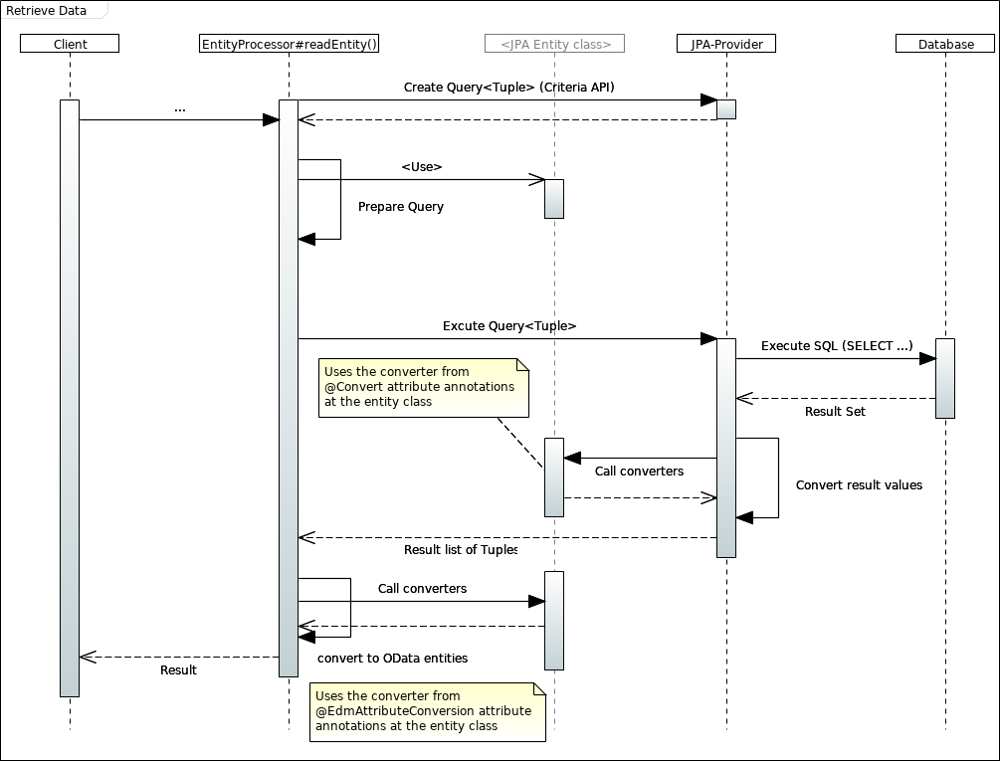

[Overview](TableOfContent.md)

---
# Read entity or entity collection
A typical OData/REST call to load data for one or more reources (like _.../Persons('1')_ or _.../Persons_) will load data from the database and convert them directly into OData entities without materialization as JPA entities (Java instances).

* Internally a tuple-query from the criteria API is used.
* Such a tuple query will convert loaded results from data base using the converters defined by attributes on the entity class (`@Entity`).
* These converted values are transformed one more time: into the OData representation of the entity class(es). This will trigger also one more value conversion to make the JPA related value types from the tuple query compatible to the data types supported by the Olingo library to built-up the OData entity representations.

# Call bound action
An action can have parameters, simple or complex, and can have also simple or complex results. A complex result may be a true entity (JPA `@Entity`) or an complex type (JPA `@Embedded`). A bound action is a method defined as instance method, other than class method for unbound actions.

The instance of an entity type to call the action (method) on it is loaded from the database. So the method is called with a data state as in the database! The client may have an different state, but without any impact to the backend side method invocation.